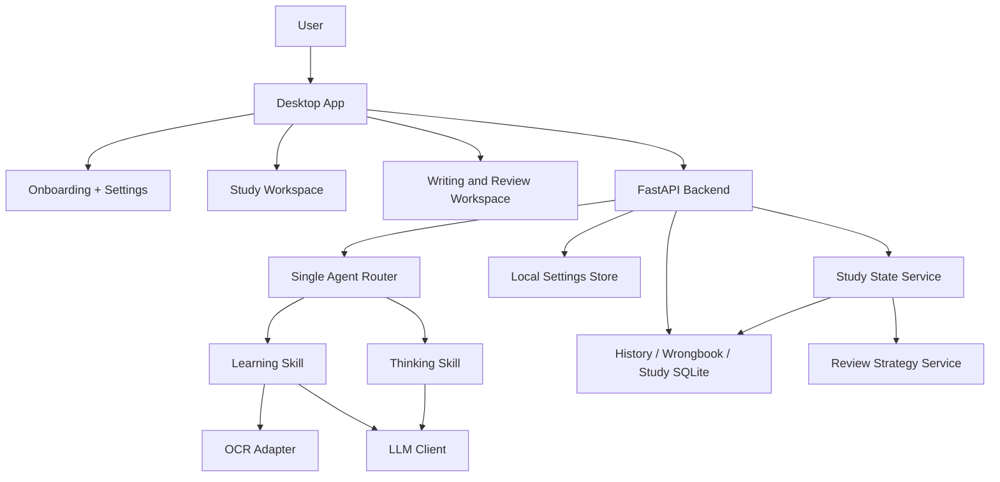

# Architecture

## High-Level



## Agent Boundary

ExamNova 现在不是“多智能体自治系统”，而是更务实的单 Agent 架构：

- Agent 负责识别当前任务属于学习还是写作复盘
- Agent 负责把输出归一化成前端可读的结构化结果
- Skills 只负责各自领域的生成逻辑，不独立自治

当前产品 skills：

- `learning`
- `thinking`

## State Layers

项目按职责分成几层：

- 前端展示层：`apps/desktop/app/`
- 后端服务层：`apps/backend/app/routes/` 和 `apps/backend/app/services/`
- 学习状态管理：`apps/backend/app/services/study_state_store.py`
- 复习策略模块：`apps/backend/app/services/review_strategy.py`
- 题目与知识数据：SQLite 中的 history、wrongbook、study_sessions、study_notes
- 模型扩展位：`apps/backend/app/services/llm_client.py`

## Real Time Review Logic

ExamNova 现在有两套时间机制，但主要服务 `learning` 工作区：

- 短时遗忘曲线：偏向考试前冲刺，关注 30 分钟、12 小时、24 小时内的巩固
- 常规遗忘曲线：偏向跨天回顾

系统同时区分两种时间：

- 真实间隔时间：`started_at -> now`
- 专注学习时间：heartbeat 累加的 active minutes

这意味着：

- 3 月 1 日开始、3 月 10 日回来，同一题仍然可以产生逾期回顾提醒
- “学习 30 分钟后弹一道题”依赖的是专注时长，不是只看页面开着多久

## Runtime Data

所有运行数据都写入项目目录或桌面应用目录旁边的数据文件夹：

```text
开发模式：<repo>\.examnova-data
桌面版：<ExamNova.exe 所在目录>\data
```

这样仓库可以安全开源，个人 Key 和学习记录不会被误提交；同时数据位置也更直观，便于你自己备份或清理。
